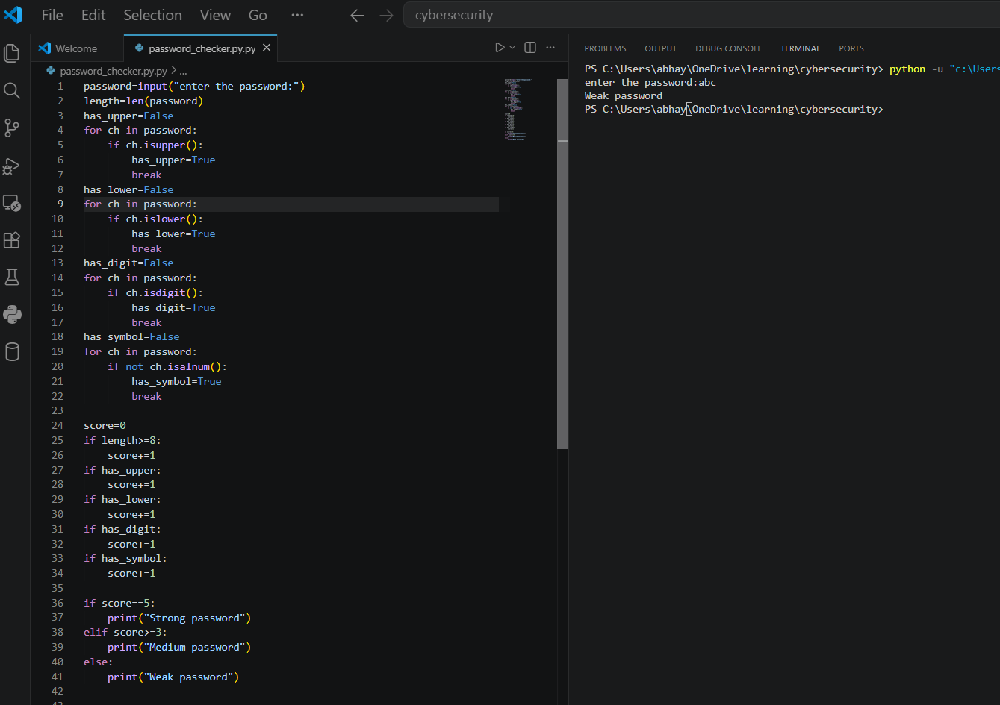
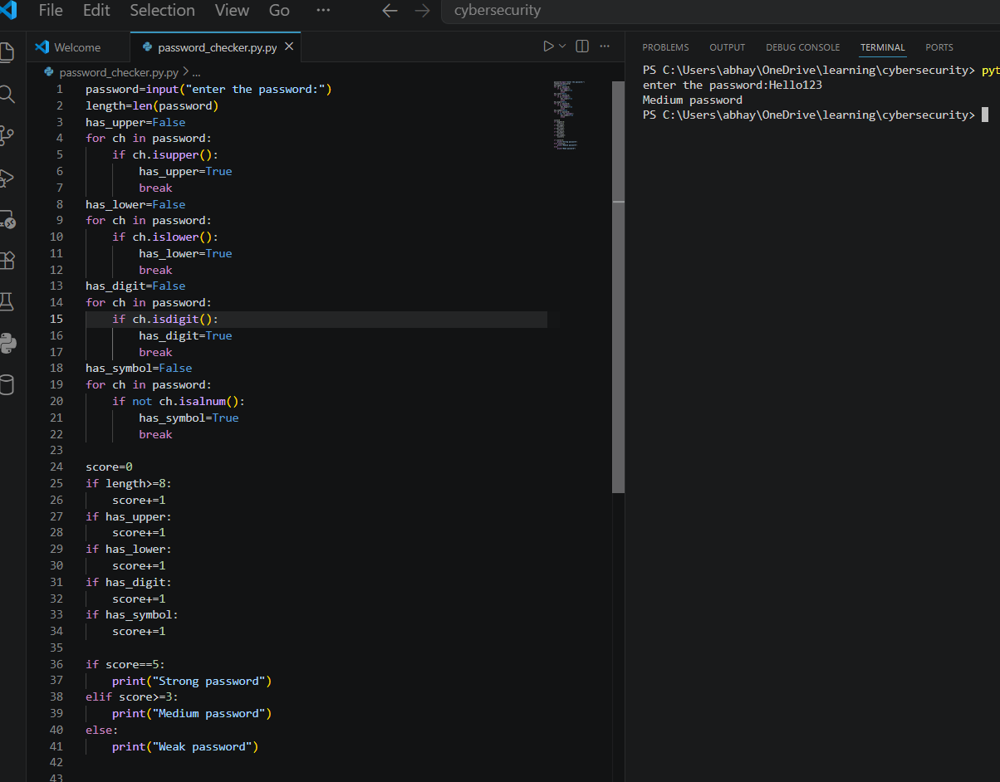
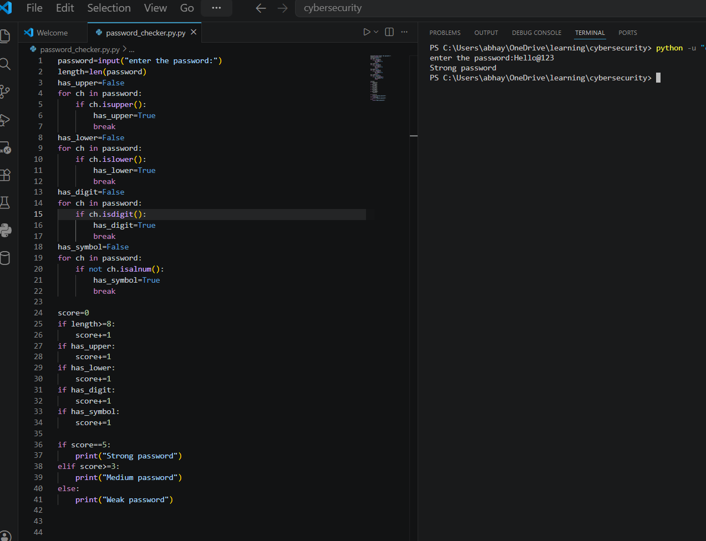

# Password-Strength-Checker

## Description
This project is a Password Strength Checker developed in Python. It checks the strength of a password based on five criteria:
- Minimum length of 8 characters
- Contains at least one uppercase letter
- Contains at least one lowercase letter
- Contains at least one digit
- Contains at least one special character

## Features
- Detects Weak, Medium, and Strong passwords.
- Easy to use.
- Beginner-friendly Python project.

## Technologies Used
- Python 3

## How to Run
1. Download the project.
2. Open the terminal.
3. Run:
   python password_checker.py
4. Enter a password when prompted.
## Sample Outputs

### Weak Password

### Medium Password

### Strong Password

## Author
Abhay B S
